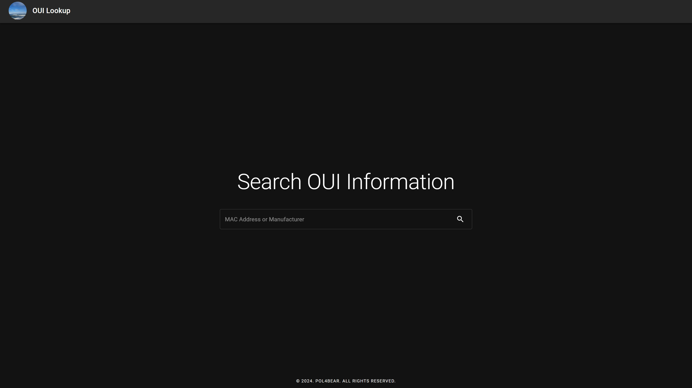
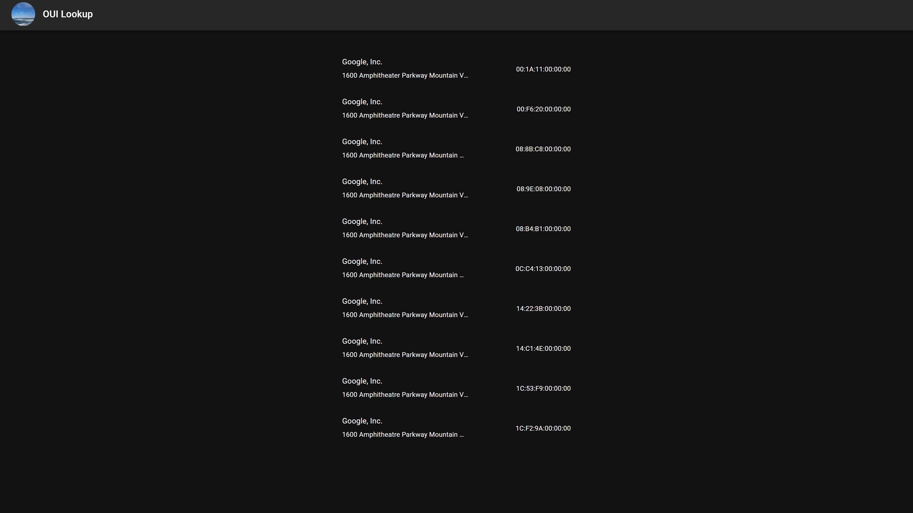

# OUI Lookup Service
## Introduction
This web service allows users to easily search and retrieve OUI (Organizationally Unique Identifier) information based on MAC addresses or manufacturer names.



## Environment Configurations
### ouilookup/.env
The project root directory contains a .env file with the following configuration:
```
ALLOWED_CORS_DOMAINS=oui.pol4.dev
```
This setting specifies the allowed domains for CORS (Cross-Origin Resource Sharing). This ensures that only requests from the specified domain are allowed to interact with the API. You can add multiple domains by separate them using commas (,).
### ouilookup/webui/.env
The webui directory contains its own .env file with the following configurations:
```
NEXT_PUBLIC_BASE_URL=https://oui.pol4.dev
NEXT_PUBLIC_API_BASE_URL=https://ouiapi.pol4.dev
NEXT_PUBLIC_BASE_URL: This is the base URL for the WebUI, which is used throughout the frontend for routing and resource loading.
NEXT_PUBLIC_API_BASE_URL: This is the base URL for the API server, which is used to make API requests from the frontend.
```

# Deployment with Docker Compose
To deploy the WebUI frontend using Docker Compose, follow these steps:

1. Navigate to the project root directory:
```sh
cd /path/to/your/project/root
```
2. Run Docker Compose:
```sh
docker-compose up -d
```
This will build and start the containers in detached mode. The WebUI frontend will be accessible at http://localhost:3000. And the API server will be accessible at http://localhost:5000. Ensure that the environment variables in the .env files are correctly set according to your deployment environment.
